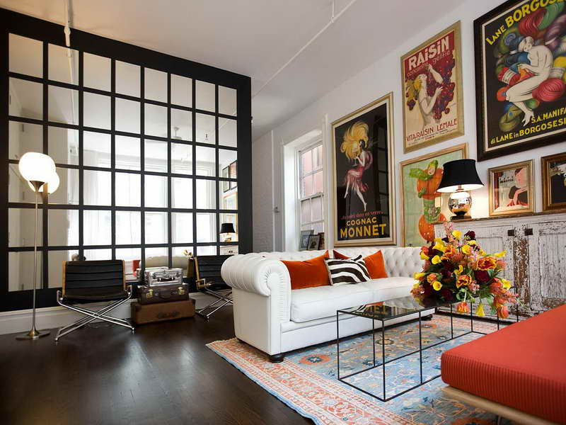

# fix-perspective-element

> Applies perspective fix transformation to DOM elements

Based on the following sources:

* http://codepen.io/fta/pen/JoGybG?editors=111
* http://codepen.io/fta/full/JoGybG/
* http://franklinta.com/2014/09/08/computing-css-matrix3d-transforms/

[![NPM][fix-perspective-element-icon] ][fix-perspective-element-url]

[![Build status][fix-perspective-element-ci-image] ][fix-perspective-element-ci-url]
[![dependencies][fix-perspective-element-dependencies-image] ][fix-perspective-element-dependencies-url]
[![devdependencies][fix-perspective-element-devdependencies-image] ][fix-perspective-element-devdependencies-url]

[fix-perspective-element-icon]: https://nodei.co/npm/fix-perspective-element.png?downloads=true
[fix-perspective-element-url]: https://npmjs.org/package/fix-perspective-element
[fix-perspective-element-ci-image]: https://travis-ci.org/bahmutov/fix-perspective-element.png?branch=master
[fix-perspective-element-ci-url]: https://travis-ci.org/bahmutov/fix-perspective-element
[fix-perspective-element-dependencies-image]: https://david-dm.org/bahmutov/fix-perspective-element.png
[fix-perspective-element-dependencies-url]: https://david-dm.org/bahmutov/fix-perspective-element
[fix-perspective-element-devdependencies-image]: https://david-dm.org/bahmutov/fix-perspective-element/dev-status.png
[fix-perspective-element-devdependencies-url]: https://david-dm.org/bahmutov/fix-perspective-element#info=devDependencies

Given transformation matrix (one can compute it from 4 points using 
[fix-perspective](https://github.com/bahmutov/fix-perspective)), transforms desired element to remove perspective
distortion. See [index.html](index.html) for a demo.

    <script src="dist/fix-perspective-element.js"></script>
    <script>
    </script>

## Perspective distortion

The example image is from [Cozy Living Room Ideas](http://cozylivingroomideas.com/) website, specifically
[how to decorate a living room with beige walls][1].

[1]: http://cozylivingroomideas.com/how-to-decorate-a-large-living-room-wall/how-to-decorate-a-living-room-with-beige-walls/

Take a look at this image: notice that every painting on the right wall is not a rectangle, but a quad.



Some paintings show smaller distortions, while larger posters show a larger effect.
Even the cells in the decorative separator wall appear smaller in the top right corner
compared to the bottom left corner.


Every object that in real life is a flat rectangle appears like a quad in the pictures
before of the *perspective distortion* - closer sides appear larger than farther sides.
In the image above I marked two posters that show the perspective distortion in different degree.

Can we restore a quad to appear like a rectangle again? Yes, and very easily. We just need
to measure the coordinates of 4 quad corners, then select how we want to map them. For example
we can take the pixel coordinates of the "Cognac Monet" poster in the image (from top left and
clockwise)

    corner         |  x    y
    ---------------------------
    top left       | 470  175
    top right      | 555  130
    bottom right   | 560  345
    bottom left    | 473  345

From an image we cannot compute the true real world size of the poster, so we can be free
to map it to any pixel dimensions. Let us assume that the poster is twice as tall as it is wide,
and we want it to be 100 by 200 pixels. We can easily compute the matrix that maps the corners
to the target coordinates

    corner         |  x    y  |  target  x    y 
    --------------------------------------------
    top left       | 470  175 |          0    0
    top right      | 555  130 |        100    0
    bottom right   | 560  345 |        100  200
    bottom left    | 473  345 |          0  200

Plug this into a call to [fix-perspective]() to get the transform
function and matrix H.

```js
var from = [{
  x: 470,
  y: 175,
}, {
  x: 555,
  y: 130
}, {
  x: 560,
  y: 345
}, {
  x: 473,
  y: 345
}];
var to = [{
  x: 0,
  y: 0,
}, {
  x: 100,
  y: 0
}, {
  x: 100,
  y: 200
}, {
  x: 0,
  y: 200
}];
var compute = require('fix-perspective');
var transform = compute(from, to);
// transform is a function from original image pixels (x, y) 
// to the poster (0,0) - (100,0) - (100,200) - (0,200) pixels
// transform.H is 4x4 matrix
```

The transform function will move and stretch the original image so that the poster
quad maps to the 100x200 rectangle with the top left corner positioned at the origin.
Everything else from the original image will stretch *around* the rectangle. We can
clip the areas of the image outside the 100x200 rectangle to hide it, since it will look very weird.

### Small print

Author: Gleb Bahmutov &copy; 2015

* [@bahmutov](https://twitter.com/bahmutov)
* [glebbahmutov.com](http://glebbahmutov.com)
* [blog](http://glebbahmutov.com/blog/)

License: [MIT](MIT-License.txt) - do anything with the code, but don't blame uTest if it does not work.

Spread the word: tweet, star on github, etc.

Support: if you find any problems with this module, email / tweet / open
[issue on Github](https://github.com/bahmutov/fix-perspective-element/issues)


